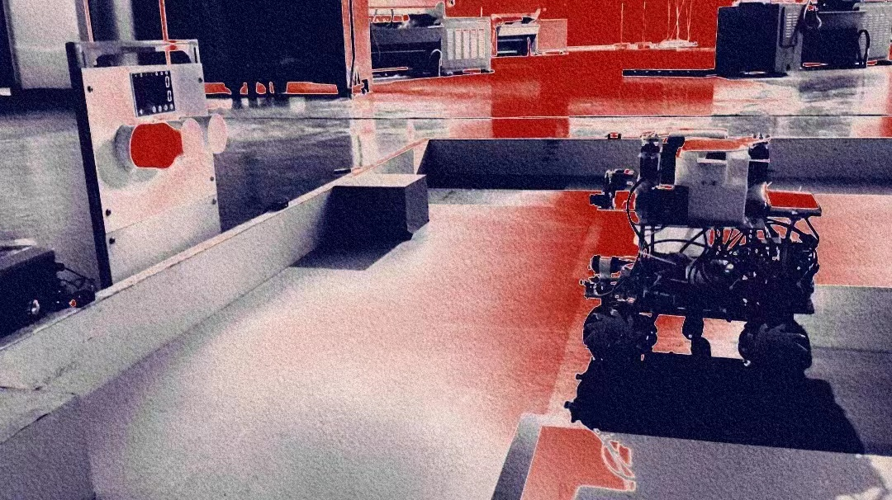

## 👋 Hi there 
- I'm a junior who major in Electronic & Information Engineering in Guang Dong University of Technology(GDUT).
- I have a great passion for VO/VIO/SLAM and Robotics.Now I'm focusing on pose estimation and direct visual odemetry.
- I'm looking for a Research-Internship/Research-Assistance positon about VO/VIO and SLAM.
- How to contact me: liwenpu0520@gmail.com.

## 🛠️ Technologies & Tools
&nbsp;&nbsp;    

&nbsp;&nbsp;   

&nbsp;&nbsp;  

&nbsp;&nbsp;   

&nbsp;&nbsp;    

## ✍️ Blog & Writing
&nbsp;&nbsp; Apart from coding and researching,I simultaneously maintain a blog including my learning notes and technical summaries.You could find my articles on website [wincent](https://www.zhihu.com/people/wincent-84) as well as on [wincent嘻嘻哈哈](https://blog.csdn.net/weixin_50950634?type=blog)

## 📈 Github Status

## 🤖 Works
<table>
  <tbody>
    <tr>
      <td align="center"><b>Robocup AS/RS</b></td>
      <td align="center"><b>NUEDC</b></td>
      <td align="center"><b>Palletizing machines</b></td>
    </tr>
    <tr></tr>
    <tr>
      <td align="center"></td>
      <td align="center"></td>
      <td align="center"></td>
    </tr>
    <tr></tr>
    <tr>
      <td align="center"><b>Drone</b></td>
      <td align="center"><b>SLAM</b></td>
      <td align="center"><b>ZED2 Camera</b></td>
    </tr>
    <tr></tr>
    <tr>
      <td align="center"></td>
      <td align="center"></td>
      <td align="center"></td>
    </tr>
    <tr></tr>
  <tbody>
</table>

<!--
**akawincent/akawincent** is a ✨ _special_ ✨ repository because its `README.md` (this file) appears on your GitHub profile.

Here are some ideas to get you started:

- 🔭 I’m currently working on ...
- 🌱 I’m currently learning ...
- 👯 I’m looking to collaborate on ...
- 🤔 I’m looking for help with ...
- 💬 Ask me about ...
- 📫 How to reach me: ...
- 😄 Pronouns: ...
- ⚡ Fun fact: ...
-->
