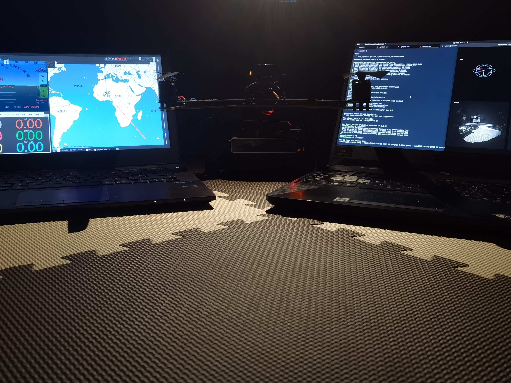

<h1 align='center'> Think Different 🤔    Go Further 🚀</h1>

## 👋 Hi there 
- I am currently working as a research assistant in [Liu Peidong's laboratory(CVGL)](https://ethliup.github.io) at Westlake University.
- I am researching 3D/4D reconstruction in computer vision and seeking collaborators to explore efficient representations of dynamic scenes and object surfaces.
- I am looking for a PhD/RA/Mphill position. Feel free to contact me! You can learn more about me on my [homepage](https://akawincent.github.io).
- How to contact me: liwenpu@westlake.edu.cn.

## ✍️ Blog & Writing
Apart from coding and researching, I simultaneously maintain a blog including my learning notes and technical summaries.You could find my articles on website [wincent](https://www.zhihu.com/people/wincent-84) as well as on [wincent嘻嘻哈哈](https://blog.csdn.net/weixin_50950634?type=blog)

## 📈 Github Status

<!--  -->

<!--
## 🤖 Works
<table>
  <tbody>
    <tr>
      <td align="center"><b>Robocup AS/RS</b></td>
      <td align="center"><b>NUEDC</b></td>
    </tr>
    <tr></tr>
    <tr>
      <td align="center"></td>
      <td align="center"></td>
    </tr>
    <tr></tr>
    <tr>
      <td align="center"><b>Drone</b></td>
      <td align="center"><b>ZED2 Camera</b></td>
    </tr>
    <tr></tr>
    <tr>
      <td align="center"></td>
      <td align="center"></td>
    </tr>
    <tr></tr>
  <tbody>
</table>
-->

<!--
**akawincent/akawincent** is a ✨ _special_ ✨ repository because its `README.md` (this file) appears on your GitHub profile.

Here are some ideas to get you started:

- 🔭 I’m currently working on ...
- 🌱 I’m currently learning ...
- 👯 I’m looking to collaborate on ...
- 🤔 I’m looking for help with ...
- 💬 Ask me about ...
- 📫 How to reach me: ...
- 😄 Pronouns: ...
- ⚡ Fun fact: ...
-->
